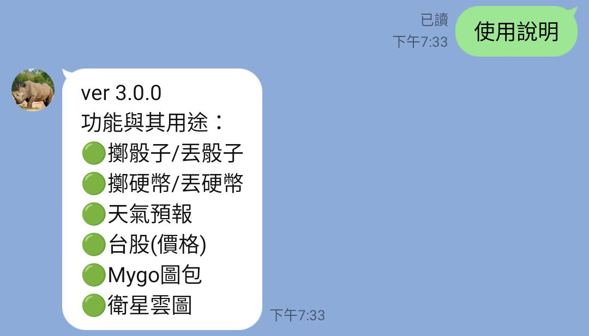
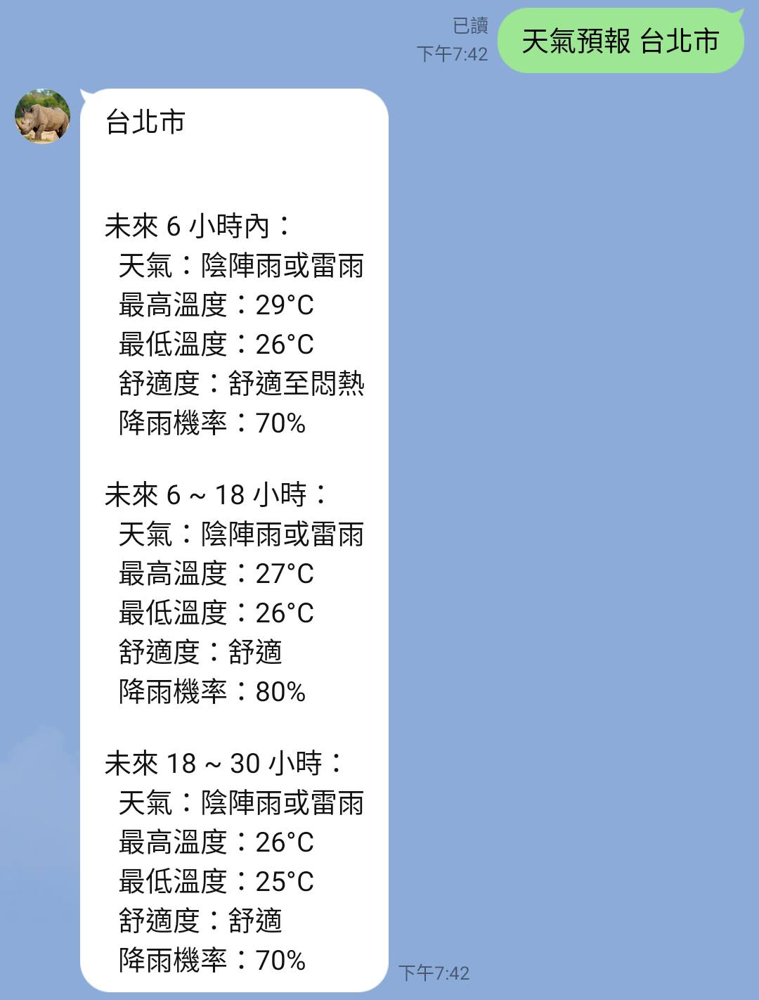
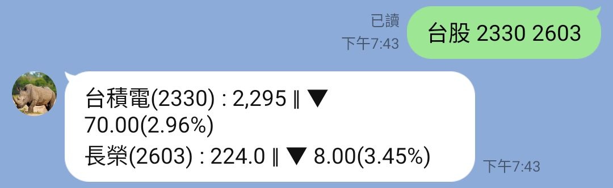
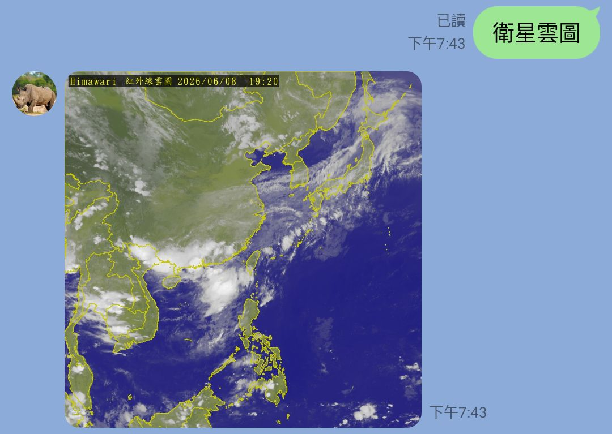

# Group LineBot

LINE 群組聊天機器人，提供多種實用與趣味功能。

## 功能演示

輸入 `使用說明` 查看所有可用指令。



### 擲骰子 / 丟骰子

隨機產生 1～6 的骰子結果。


### 擲硬幣 / 丟硬幣

隨機回傳「正」或「反」，也可以輸入 `硬幣` 觸發。


### 天氣預報

輸入 `天氣預報 <地區>` 查詢台灣各縣市的天氣資訊，包含溫度、舒適度與降雨機率。



### 台股

輸入 `台股 <股票代號/名稱>` 查詢即時股價與漲跌幅，支援一次查詢多檔。



### Mygo 圖包

輸入 Mygo 動畫中的台詞，機器人會自動回應對應的圖片 (不包含所有台詞)。


### 衛星雲圖

輸入 `衛星雲圖` 取得最新的 Himawari 紅外線衛星雲圖。



## 安裝與啟動

```bash
pip install -r requirements.txt
```

在專案根目錄建立 `.env` 檔案，填入以下環境變數：

| 變數 | 說明 |
|---|---|
| `CHANNEL_ACCESS_TOKEN` | LINE Channel Access Token |
| `CHANNEL_SECRET` | LINE Channel Secret |
| `MOTC_API` | 中央氣象署 Open Data API Key |
| `TIMEZONE` | 時區（預設 `Etc/GMT-8`） |
| `MYGO_BASE_URL` | Mygo 圖片的公開 URL 前綴 |

啟動伺服器：

```bash
python app.py
```

將 LINE webhook URL 設定為 `https://<your-domain>/callback`。

## 技術

- Python / Flask
- LINE Messaging API（line-bot-sdk）
- BeautifulSoup（網頁爬蟲）
- aiohttp（非同步 HTTP 請求）
